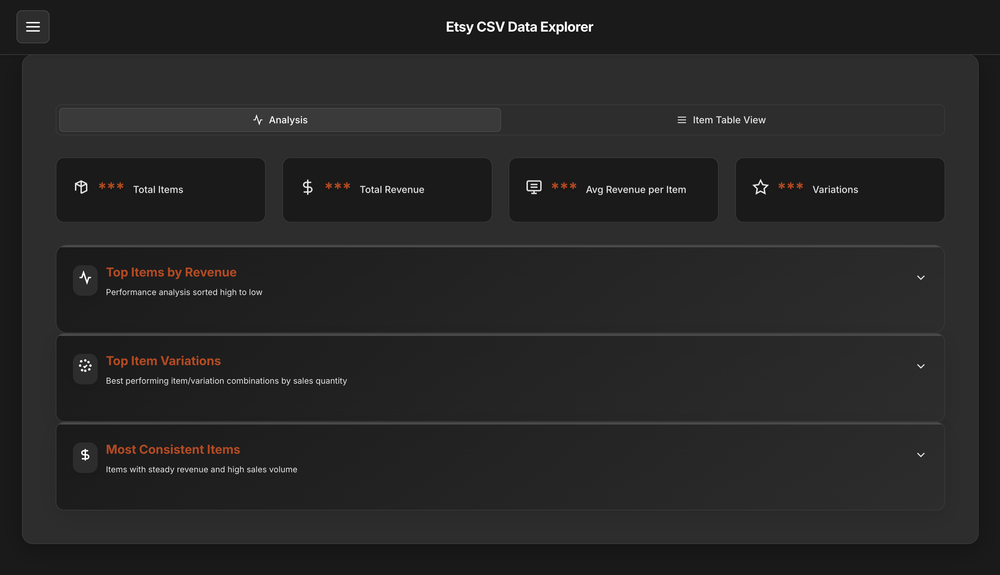
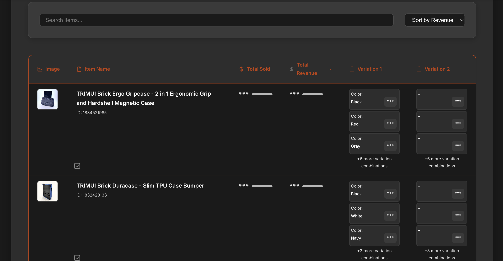
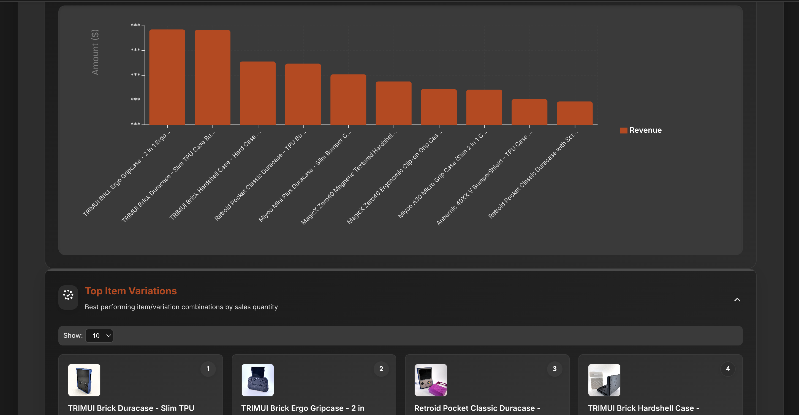
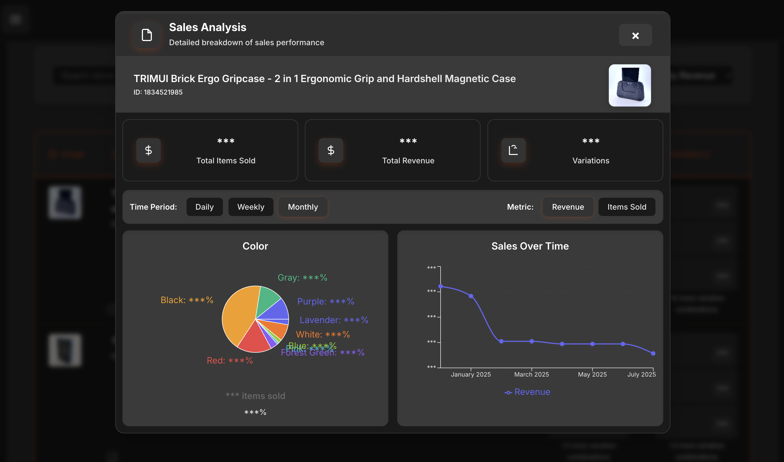

# Etsy CSV Explorer

A web application for analyzing and visualizing Etsy sales data from CSV exports. Built with React, TypeScript, and Vite, this tool helps to analyze sales patterns and product performance.

**Live Demo**: [https://www.etsycsv.dildesigns.com/](https://www.etsycsv.dildesigns.com/)


## Features

Long story short, this does a few things and lets you visualize some things in ways that Etsy. 

- Lets you compare sales and revenue between different items in a graphical format
- See which item variations are the most popular between all items
- See what variations with a certain item are the most popular
- See sales data over time for a particular item

Also gives you some nice things
- See revenue and sales number for an item over a certain timer period
- See the most consistent items based on the coefficient of variation of revenue
- Anonymize the data if you want to take a screenshot (like I did here)
- Fuse a sold order items CSV with the listings CSV to add images to the view.

Yeah, you could just do some Excel stuff, but who the hell wants to do that?


## Screenshots

### Main Dashboard

*Main application interface showing the dashboard with key metrics and navigation*

### Data Table View

*Table view displaying sales data with sorting and filtering options*

### Analysis Charts

*Analysis tab with interactive charts and data visualizations*

### Item Details Modal

*Detailed modal window showing comprehensive item information*

## Installation

1. Clone the repository:
   ```bash
   git clone <repository-url>
   cd etsy-csv-explorer
   ```

2. Install dependencies:
   ```bash
   npm install
   ```

3. Start the development server:
   ```bash
   npm run dev
   ```

4. Open your browser and navigate to the URL given.

## Usage

1. Export your sales data from Etsy as a CSV file
2. Upload the CSV file to the application
3. Explore your data using the various views and filters
4. Use the analysis tools to gain insights into your sales performance

## Technology Stack

- **Frontend**: React 19, TypeScript
- **Build Tool**: Vite
- **CSV Processing**: PapaParse
- **Charts**: Recharts

## Project Structure

```
src/
├── components/          # Reusable UI components
├── hooks/              # Custom React hooks
├── styles/             # CSS files and styling
├── types.ts           # TypeScript type definitions
├── utils.ts           # Utility functions
└── App.tsx            # Main application component
```

## License

This project is licensed under the MIT + Commons Clause License Condition v1.0 - see the [LICENSE](LICENSE.md) file for details.

## Development

### Available Scripts

- `npm run dev` - Start development server
- `npm run build` - Build for production
- `npm run lint` - Run ESLint
- `npm run preview` - Preview production build